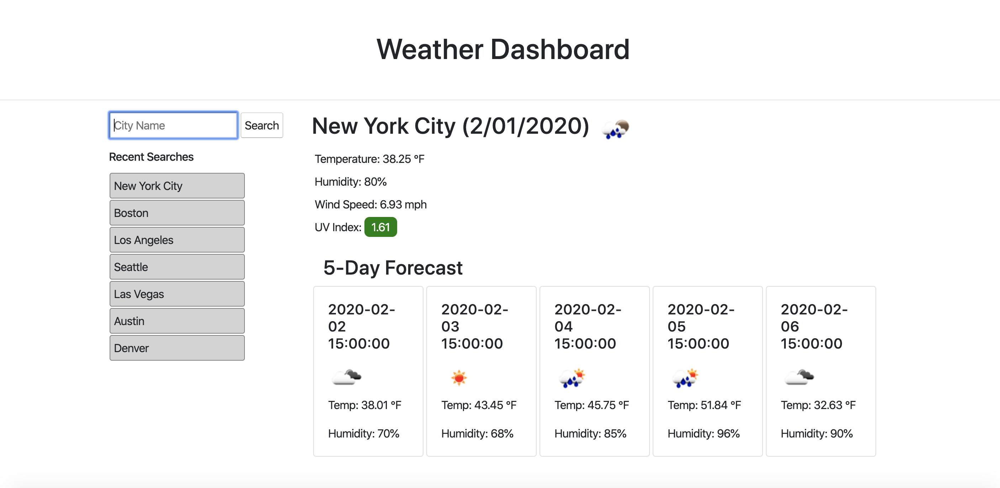

Weather Dashboard

  

This is a Weather Dashboard application that allows a user to search for a city's weather. The current weather and 5 day forecast will display on the dashboard once the user searches for a city. It calls the OpenWeather API to retrieve the data. The current weather displays the city name, date, a weather icon representing conditions, the  temperature, humidity, wind speed, and a color coded UV Index value indicating low to high precaution. The 5-Day Forecast displays the date, a weather icon, the temperature, and humidity.  

The user can look back on recent searches and click on a particular searched city to resubmit that city for the weather information. The recent searches tab will display and locally store the last 10 recent searches.  

This application was built with HTML, styed with CSS and Bootstrap, and made dynamic using Javascript and jQuery. Font Awesome and Moment.js were also utilized.  

Project files:  

    index.html  
    style.css  
    script.js  

Deployed Web Page:  
https://ilanashaffer.github.io/Homework-6/  

Built with:  
Visual Studio Code  
HTML  
CSS  
Javascript
jQuery    
Moment.js  
Bootstrap  
Font Awesome  

Authors:  
Ilana Shaffer  

Acknowledgments:  
University of Denver - Bootcamp Spot Assignment